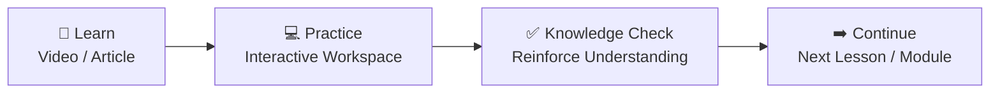
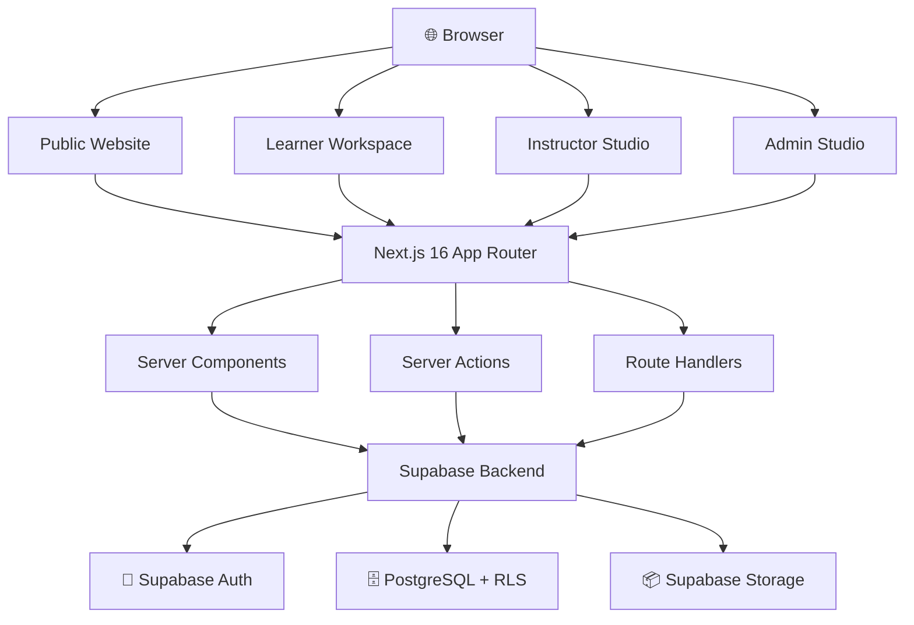
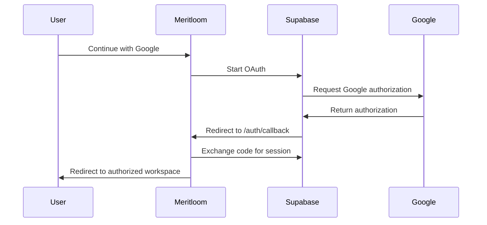
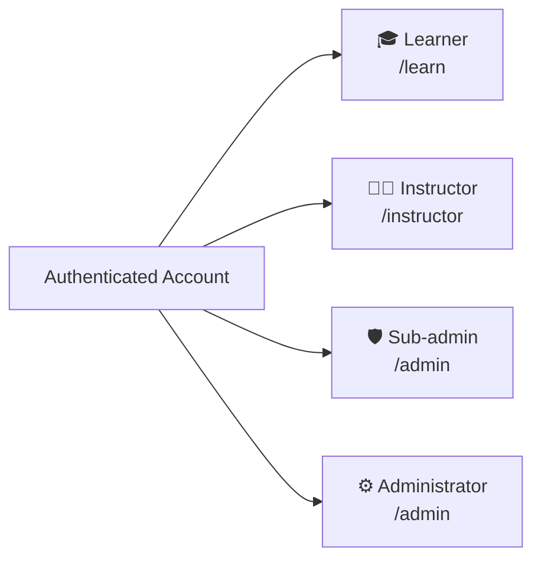
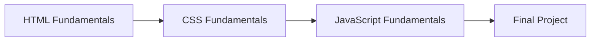
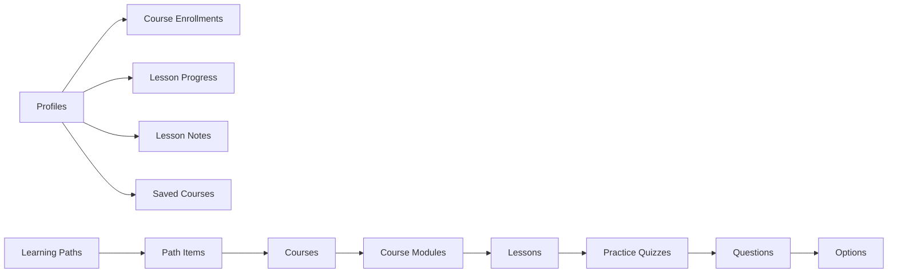

<div align="center">

# Meritloom

### Learn. Practice. Understand. Progress.

**Meritloom is a free, structured learning platform designed to help learners understand concepts, practice them in-browser, reinforce their knowledge, and continue learning at their own pace.**

<br />

[](https://nextjs.org/)
[](https://react.dev/)
[](https://www.typescriptlang.org/)
[](https://supabase.com/)
[](https://tailwindcss.com/)
[](https://vercel.com/)

<br />

[**🌐 Open Meritloom**](https://meritloom.iabir.me)
&nbsp;&nbsp;•&nbsp;&nbsp;
[**📚 Explore Courses**](https://meritloom.iabir.me/courses)
&nbsp;&nbsp;•&nbsp;&nbsp;
[**🧭 Learning Paths**](https://meritloom.iabir.me/learning-paths)

</div>

---

> [!NOTE]
> Meritloom is designed around learning rather than gamification.  
> There are no paid tiers, XP systems, leaderboards, forced streaks, or score-based course locks.

---

## ✨ Why Meritloom?

<table>
<tr>
<td width="50%" valign="top">

### 🎓 Structured Learning

Courses are organized into modules and lessons with clear learning objectives and guided progression.

</td>
<td width="50%" valign="top">

### 💻 Practice While Learning

Learners can work with HTML, CSS, and JavaScript directly inside an interactive browser workspace.

</td>
</tr>

<tr>
<td width="50%" valign="top">

### ✅ Knowledge Checks

Module-level checks reinforce concepts with explanations and unlimited retries without blocking access to later lessons.

</td>
<td width="50%" valign="top">

### 🧭 Learning Paths

Recommended learning sequences connect related courses and projects into a clear development journey.

</td>
</tr>

<tr>
<td width="50%" valign="top">

### 🔐 Privacy by Default

Learner-specific records are protected using Supabase authentication, PostgreSQL Row Level Security, and server-side authorization.

</td>
<td width="50%" valign="top">

### 🆓 Free by Design

Meritloom focuses on accessible learning without subscriptions, paywalls, or premium course gates.

</td>
</tr>
</table>

---

## 🔄 Learning Model

Meritloom follows a simple learning cycle:



### The four stages

**1. Learn**  
Study a structured video or written lesson with objectives, key ideas, and supporting resources.

**2. Practice**  
Apply the concept using browser-based practice activities and coding exercises.

**3. Check Understanding**  
Complete a Knowledge Check and review explanations. Retries are unlimited.

**4. Continue**  
Move naturally to the next lesson, module, course, or recommended Learning Path item.

> Quiz scores help learners understand what to review. They do **not** lock future course content.

---

## 🧩 Workspaces

Meritloom provides different workspaces for different responsibilities.

<table>
<tr>
<td width="33%" valign="top">

### 🎓 Learner

**Route:** `/learn`

Personal learning workspace.

**Includes**

- Learner Home
- My Learning
- Course Explorer
- Lesson Player
- Practice Workspace
- Knowledge Checks
- Saved Courses
- Notes
- Learning Paths
- Progress
- Profile & Account

</td>

<td width="33%" valign="top">

### 🧑‍🏫 Instructor

**Route:** `/instructor`

Assigned-course management workspace.

**Includes**

- Instructor Dashboard
- Assigned Courses
- Curriculum Editor
- Lesson Authoring
- Knowledge Checks
- Course Quality
- Instructor Profile

Instructor access is limited to assigned courses.

</td>

<td width="33%" valign="top">

### 🛡️ Admin Studio

**Route:** `/admin`

Platform management workspace.

**Includes**

- Courses
- Learning Paths
- Users
- Staff
- Permissions
- Content Quality
- System Health
- Audit Log
- Support Messages
- Categories & Skills
- Content Tools

</td>
</tr>
</table>

### Delegated Sub-admin Access

Sub-admins use the same `/admin` workspace, but the dashboard, sidebar, queries, and actions are filtered according to their assigned permissions.

Navigation visibility is only a UX feature. Authorization is always checked again on the server.

---

## ⚡ Quick Start

```bash
# Clone Meritloom
git clone https://github.com/iRfANhAiDeRABiR/Meritloom--Mastery-Learning-Platform.git

# Enter the project
cd Meritloom--Mastery-Learning-Platform

# Install dependencies
npm install

# Create local environment configuration
cp .env.example .env.local

# Start development server
npm run dev
```

Open:

```text
http://localhost:3000
```

> [!TIP]
> The first visit to a route can be slower in development because Turbopack may compile that route on demand. Always test real performance with a production build as well.

---

## 🛠️ Tech at a Glance

| Layer | Technology |
| --- | --- |
| **Framework** | Next.js 16.3.3 App Router |
| **UI Runtime** | React 19 |
| **Language** | TypeScript |
| **Styling** | Tailwind CSS v4 |
| **Database** | PostgreSQL via Supabase |
| **Authentication** | Supabase Auth |
| **Storage** | Supabase Storage |
| **Authorization** | RLS + server-side RBAC |
| **UI Primitives** | Radix UI |
| **Notifications** | Sonner |
| **Icons** | Lucide React |
| **Theme** | next-themes |
| **Typography** | DM Sans |
| **Deployment** | Vercel |

---

## 🏗️ Architecture



### Application philosophy

- Server Components by default
- Small Client Components for interactive UI
- Server Actions for trusted mutations
- Supabase RLS for learner-private records
- Server-side permission enforcement for staff
- Request-level memoization for repeated user/profile lookups
- Shared data/query helpers instead of page-specific duplication

---

## 🔐 Authentication Flow

Meritloom supports email/password authentication and Google OAuth.



Meritloom uses Supabase SSR session handling and secure server-side callback processing.

---

## 👤 Roles & Access



| Role | Workspace | Purpose |
| --- | --- | --- |
| `learner` | `/learn` | Personal learning |
| `instructor` | `/instructor` | Assigned-course management |
| `sub_admin` | `/admin` | Delegated administration |
| `admin` | `/admin` | Full platform administration |

Staff accounts can switch between the workspaces they are already authorized to access.

> [!IMPORTANT]
> Workspace buttons do **not** grant privileges. Server-side role and permission checks remain authoritative.

---

# Platform Features

## 🎓 Learner Experience

### Learner Dashboard

`/learn`

A personalized learning home with:

- Continue Learning
- Active courses
- Weekly learning summary
- Learning Path progress
- Recent learning activity
- Saved content
- Recent notes

### My Learning

`/learn/courses`

Learners can:

- View enrolled courses
- See completion progress
- Resume the next lesson
- Review completed courses
- Search/filter their learning library

### Explore Courses

`/learn/explore`

Authenticated course discovery with:

- Search
- Difficulty filtering
- Category filtering
- Enrollment state
- Saved status
- Real progress for existing enrollments

The public `/courses` catalog remains separate for anonymous visitors.

### Lesson Player

Structured learning workspace containing:

- Course outline
- Video or lesson content
- Learning objectives
- Key ideas
- Resources
- Notes
- Bookmarks
- Previous/next navigation

### Saved Courses

`/learn/saved`

Private list of courses the learner wants to revisit.

### Notes

`/learn/notes`

Private lesson notes associated with course content.

### Profile

`/profile`

Account and profile management including:

- Display information
- Avatar
- Appearance
- Account settings
- Password management

---

## 💻 Practice Workspace

Meritloom provides a browser-based coding environment for practice lessons.

### Supported areas

- HTML
- CSS
- JavaScript

### Safety model

Learner code runs inside a restricted iframe sandbox rather than the Meritloom application context.

```text
Meritloom Application
        │
        ├── Editor
        │
        └── Sandboxed Preview
                │
                └── Learner HTML / CSS / JavaScript
```

Practice drafts can persist across sessions through learner-private storage.

---

## ✅ Knowledge Checks

Knowledge Checks reinforce module concepts without creating artificial access gates.

Features include:

- Single-choice questions
- Multiple-choice questions
- True/false questions
- Server-side grading
- Answer explanations
- Topic information
- Unlimited retries
- Attempt history

Correct answer mappings remain server/private and are not sent to learners before submission.

---

## 🧭 Learning Paths

Learning Paths combine related courses into recommended sequences.

Example:



Learning Paths are recommendations.

They do **not** lock later courses behind quiz scores or mastery thresholds.

---

## 🧑‍🏫 Instructor Studio

`/instructor`

Instructor Studio is a dedicated workspace for course instructors.

### Core capabilities

- View assigned courses
- Edit assigned curriculum
- Create/edit modules
- Manage lessons
- Configure Practice activities
- Manage Knowledge Checks
- Review Content Quality issues
- Preview course content
- Manage instructor profile

Instructor authorization is validated against course assignments.

An instructor cannot edit another instructor's unassigned course by manually changing the URL.

---

## 🛡️ Admin Studio

`/admin`

Admin Studio provides platform-management capabilities.

### Main areas

- Overview
- Courses
- Knowledge Checks
- Learning Paths
- Users
- Staff
- System Health
- Audit Log
- Support Messages
- Content Tools
- Categories
- Skills
- Content Quality

### Users & Staff

Administrators can manage:

- User roles
- Instructor assignments
- Sub-admin access
- Account suspension/reactivation
- Staff permissions

Suspending an account does not erase its learning data or course assignments.

---

## 🔑 Delegated Sub-admin Permissions

Sub-admins receive only explicitly granted administration capabilities.

Examples may include:

```text
users.view
users.suspend
users.reactivate

courses.view
courses.create
courses.edit
courses.publish

learning_paths.view
learning_paths.edit

quality.view
quality.run

system.view
staff.view
```

Actual permission names are defined by the application's permission system.

A sub-admin cannot promote themselves to root administrator or bypass server authorization.

---

## 🩺 System Health

> ### System Health Dashboard
>
> **Route:** `/admin/system`
>
> Operational visibility for Meritloom administrators.

The dashboard can surface:

- Application health
- Database health
- Authentication availability
- Database response latency
- Route response time
- Request load
- Performance trends
- Recent sanitized operational errors
- Content integrity warnings
- Security-check summaries

System Health is operational tooling—not learner analytics.

---

## 🚨 Error Experience

Meritloom provides branded error handling instead of exposing raw framework or database errors.

| Type | User Experience |
| --- | --- |
| `404` | Branded Page Not Found |
| `401` | Sign-in/session guidance |
| `403` | Access restricted |
| `500` | Retryable application error |
| `503` | Temporary service unavailable |

Application error pages may provide safe reference identifiers for support.

Raw stack traces, SQL errors, authentication tokens, and secrets are never intended for public error pages.

---

# Database

Meritloom uses PostgreSQL through Supabase.



## Domain Overview

<table>
<tr>
<td width="50%" valign="top">

### 📚 Content

`courses`  
`course_modules`  
`lessons`  
`categories`  
`skills`  
`course_skills`  
`lesson_resources`  
`lesson_objectives`

</td>

<td width="50%" valign="top">

### 🎓 Learner Data

`profiles`  
`course_enrollments`  
`lesson_progress`  
`saved_courses`  
`lesson_notes`  
`lesson_bookmarks`  
`lesson_practice_drafts`

</td>
</tr>

<tr>
<td width="50%" valign="top">

### ✅ Knowledge Checks

`practice_quizzes`  
`practice_questions`  
`practice_question_options`  
`practice_question_correct_options`  
`practice_quiz_attempts`

</td>

<td width="50%" valign="top">

### 🛡️ Administration

`staff_permissions`  
`course_instructors`  
`admin_audit_log`  
`support_messages`  
`system_performance_metrics`

</td>
</tr>
</table>

<details>
<summary><strong>View important database conventions</strong></summary>

<br />

### Course Modules

Course modules maintain stable identity using course + slug while their position controls ordering.

Important uniqueness rules include:

```text
UNIQUE(course_id, slug)
UNIQUE(course_id, position)
```

### Lessons

Lesson slugs are treated as stable identifiers in the current content model.

### Knowledge Check Answers

Correct question mappings are stored separately from public question/option content and remain protected from learner access.

### Learner Data

Progress, notes, bookmarks, drafts, saved courses, and quiz attempts are user-owned records protected through RLS policies.

</details>

---

# 🔐 Security

<table>
<tr>
<td width="50%" valign="top">

### 🔒 Row Level Security

Learner-specific records are protected with PostgreSQL Row Level Security.

</td>

<td width="50%" valign="top">

### 🛡️ Server Authorization

Admin, sub-admin, and instructor actions are validated on the server.

</td>
</tr>

<tr>
<td width="50%" valign="top">

### 🔑 Secret Isolation

Server secrets and privileged Supabase credentials must never be exposed through `NEXT_PUBLIC_*` variables or Client Components.

</td>

<td width="50%" valign="top">

### 💻 Sandboxed Practice

Learner code executes inside a restricted iframe environment instead of the application runtime.

</td>
</tr>
</table>

Additional protections include:

- Safe OAuth callback handling
- Internal-only redirect validation
- Account suspension enforcement
- Private Knowledge Check answer mappings
- Sanitized error reporting
- Staff permission checks
- Instructor course assignment checks
- No trust in browser-provided user IDs or roles

> [!WARNING]
> UI visibility is not authorization. Every privileged operation must still be checked on the server.

---

# ⚡ Performance

Meritloom is designed to keep navigation and data-heavy pages responsive.

### Main strategies

- Server Components by default
- Small interactive Client Components
- Request-level auth/profile memoization
- Parallel independent server queries
- Batched learner state queries
- Avoidance of N+1 database patterns
- PostgreSQL indexes for frequent lookups
- Next.js internal route navigation
- Route prefetching
- Image optimization
- Lazy-loading heavy editors
- Limited dashboard payloads
- Public content caching where appropriate

Private learner/staff data remains dynamic and must never be globally cached across users.

---

# 🗂️ Project Structure

```text
meritloom/
│
├── public/
│   └── Static assets and brand resources
│
├── scripts/
│   └── Database and maintenance utilities
│
├── src/
│   │
│   ├── app/
│   │   ├── admin/
│   │   ├── auth/
│   │   ├── instructor/
│   │   ├── learn/
│   │   ├── profile/
│   │   ├── error.tsx
│   │   ├── global-error.tsx
│   │   ├── not-found.tsx
│   │   └── layout.tsx
│   │
│   ├── components/
│   │   ├── admin/
│   │   ├── auth/
│   │   ├── brand/
│   │   ├── common/
│   │   ├── errors/
│   │   ├── instructor/
│   │   ├── landing/
│   │   ├── learn/
│   │   ├── staff/
│   │   ├── theme/
│   │   └── ui/
│   │
│   └── lib/
│       ├── actions/
│       ├── auth/
│       ├── errors/
│       ├── profile/
│       ├── queries/
│       ├── supabase/
│       ├── system-health/
│       └── types/
│
├── supabase/
│   ├── migrations/
│   ├── schema.sql
│   └── seed/
│
└── package.json
```

---

# 🛣️ Application Routes

<details>
<summary><strong>🌐 Public Routes</strong></summary>

<br />

| Route | Purpose |
| --- | --- |
| `/` | Landing page |
| `/courses` | Public course catalog |
| `/courses/[slug]` | Public course details |
| `/learning-paths` | Learning Path explorer |
| `/learning-paths/[slug]` | Learning Path details |
| `/how-it-works` | Platform explanation |
| `/about` | About Meritloom |
| `/help` | Help Center |
| `/contact` | Contact/support |
| `/privacy` | Privacy |
| `/terms` | Terms |

</details>

<details>
<summary><strong>🎓 Learner Routes</strong></summary>

<br />

| Route | Purpose |
| --- | --- |
| `/learn` | Learner Dashboard |
| `/learn/courses` | My Learning |
| `/learn/explore` | Authenticated course discovery |
| `/learn/courses/[slug]` | Course learning overview |
| `/learn/courses/[slug]/lessons/[lessonSlug]` | Lesson workspace |
| `/learn/courses/[slug]/complete` | Course completion |
| `/learn/learning-paths/[slug]/complete` | Learning Path completion |
| `/learn/saved` | Saved courses |
| `/learn/notes` | Lesson notes |
| `/learn/activity` | Learning activity |
| `/profile` | Profile & account settings |

</details>

<details>
<summary><strong>🧑‍🏫 Instructor Routes</strong></summary>

<br />

| Route | Purpose |
| --- | --- |
| `/instructor` | Instructor Dashboard |
| `/instructor/courses` | Assigned courses |
| `/instructor/courses/[courseId]` | Assigned course editor |
| `/instructor/quality` | Assigned course quality |
| `/instructor/profile` | Instructor profile |

</details>

<details>
<summary><strong>🛡️ Admin Routes</strong></summary>

<br />

| Route | Purpose |
| --- | --- |
| `/admin` | Admin / Sub-admin Dashboard |
| `/admin/courses` | Course management |
| `/admin/learning-paths` | Learning Path management |
| `/admin/users` | User management |
| `/admin/staff` | Staff management |
| `/admin/system` | System Health |
| `/admin/audit-log` | Administrative audit log |
| `/admin/content-tools` | Content import/export |
| `/admin/categories` | Categories |
| `/admin/skills` | Skills |

</details>

<details>
<summary><strong>🔐 Authentication & System Routes</strong></summary>

<br />

| Route | Purpose |
| --- | --- |
| `/auth/sign-in` | Sign in |
| `/auth/sign-up` | Create account |
| `/auth/callback` | OAuth callback |
| `/auth/forgot-password` | Request password recovery |
| `/auth/reset-password` | Reset password |
| `/account-suspended` | Suspended account state |
| `/error` | Controlled safe error page |

</details>

---

# 🌐 Google OAuth

<details>
<summary><strong>View Google OAuth configuration</strong></summary>

<br />

Meritloom uses Supabase Auth as the OAuth intermediary.

### Supabase URL Configuration

Development Site URL:

```text
http://localhost:3000
```

Production Site URL:

```text
https://meritloom.iabir.me
```

Allowed application callbacks:

```text
http://localhost:3000/auth/callback
https://meritloom.iabir.me/auth/callback
```

### Google Cloud

The Google OAuth Authorized Redirect URI must point to the Supabase callback shown by your Supabase project:

```text
https://<your-project-ref>.supabase.co/auth/v1/callback
```

Authorized JavaScript origins:

```text
http://localhost:3000
https://meritloom.iabir.me
```

> Never expose the Google OAuth Client Secret in the browser or repository.

</details>

---

# 🚀 Development Setup

## 1. Prerequisites

Recommended:

```text
Node.js 20.x or 22.x
npm 10+
Supabase project
```

---

## 2. Clone

```bash
git clone https://github.com/iRfANhAiDeRABiR/Meritloom--Mastery-Learning-Platform.git
cd Meritloom--Mastery-Learning-Platform
```

---

## 3. Install

```bash
npm install
```

---

## 4. Environment

Create:

```text
.env.local
```

If `.env.example` exists:

```bash
cp .env.example .env.local
```

### Environment Variables

| Variable | Requirement | Purpose |
| --- | --- | --- |
| `NEXT_PUBLIC_SUPABASE_URL` | Required | Supabase project URL |
| `NEXT_PUBLIC_SUPABASE_ANON_KEY` | Required | Public Supabase client key |
| `NEXT_PUBLIC_SITE_URL` | Optional/config dependent | Canonical application URL |
| `YOUTUBE_API_KEY` | Optional | Admin playlist import tools |

> [!CAUTION]
> Server-only credentials must never use a `NEXT_PUBLIC_` prefix, be committed to Git, or be imported into Client Components.

If a `SUPABASE_SERVICE_ROLE_KEY` is used by server-only operational tooling, it must remain strictly server-side.

---

## 5. Supabase

<details>
<summary><strong>View Supabase setup instructions</strong></summary>

<br />

Link your Supabase project if required:

```bash
npx supabase link --project-ref <your-project-ref>
```

Apply migrations:

```bash
npx supabase db push
```

Alternatively, apply migration files according to the repository's documented migration workflow.

### Important content-seed rule

Schema migrations and curriculum/content seeds should be treated separately.

Do not run destructive seed/reset scripts against production data unless the script is explicitly designed and reviewed for production.

Existing course/module/lesson IDs may already be referenced by:

- learner progress
- notes
- bookmarks
- quiz attempts
- practice drafts
- enrollments

Preserve stable identifiers whenever content is updated.

</details>

---

## 6. Run Development Server

```bash
npm run dev
```

Open:

```text
http://localhost:3000
```

---

# 📦 Available Scripts

| Command | Purpose |
| --- | --- |
| `npm run dev` | Start development server |
| `npm run build` | Create production build |
| `npm run start` | Run production server |
| `npm run lint` | Run ESLint |
| `npm run typecheck` | Run TypeScript type checking |

---

# 🏭 Production Build

Before deployment:

```bash
npm run typecheck
npm run lint
npm run build
```

Run the built application locally:

```bash
npm run start
```

---

# ▲ Deployment

Meritloom is deployed using Vercel.

Production:

### [https://meritloom.iabir.me](https://meritloom.iabir.me)

Deployment requires:

```text
Next.js production build
        ↓
Production environment variables
        ↓
Vercel deployment
        ↓
Custom domain
        ↓
Supabase production URL configuration
        ↓
Google OAuth production configuration
```

Never use temporary Vercel preview URLs as the canonical production OAuth destination.

---

# 🧪 Platform Capabilities

| Capability | Learner | Instructor | Admin / Sub-admin |
| --- | :---: | :---: | :---: |
| View courses | ✅ | ✅ | ✅ |
| Enroll in courses | ✅ | — | — |
| Track personal progress | ✅ | — | — |
| Practice Workspace | ✅ | Preview | Manage |
| Knowledge Checks | ✅ | Assigned courses | Manage |
| Course editing | — | Assigned only | Permission based |
| Learning Path editing | — | — | Permission based |
| User management | — | — | Permission based |
| Staff management | — | — | Restricted |
| System Health | — | — | Permission based |
| Audit Log | — | — | Restricted |

---

# 🧯 Troubleshooting

<details>
<summary><strong>Google OAuth redirects to the wrong domain</strong></summary>

<br />

Check:

1. Supabase **Site URL**
2. Supabase **Redirect URLs**
3. OAuth `redirectTo`
4. `/auth/callback` origin handling

Production should use:

```text
https://meritloom.iabir.me
```

Do not use an obsolete `*.vercel.app` deployment as the canonical production URL.

</details>

<details>
<summary><strong>Google shows redirect_uri_mismatch</strong></summary>

<br />

Google Cloud must contain the exact Supabase OAuth callback:

```text
https://<your-project-ref>.supabase.co/auth/v1/callback
```

The application `/auth/callback` belongs in Supabase's allowed redirect list, not as the Google OAuth callback itself.

</details>

<details>
<summary><strong>Google or custom profile avatar is broken</strong></summary>

<br />

Verify:

- Avatar URL is valid
- Google host is permitted in `next.config`
- Supabase Storage URL/path is correctly resolved
- Shared Avatar component falls back to initials

Google-hosted avatars commonly use:

```text
lh3.googleusercontent.com
```

Do not add unrestricted wildcard image domains.

</details>

<details>
<summary><strong>Supabase seed fails with a unique constraint</strong></summary>

<br />

Do not disable uniqueness constraints merely to make a seed pass.

Inspect:

```text
course_modules:
UNIQUE(course_id, slug)
UNIQUE(course_id, position)

lessons:
UNIQUE(slug)
```

When updating existing curriculum, preserve stable content IDs and reconcile ordering safely.

Never blindly delete/recreate production courses that already have learner data.

</details>

<details>
<summary><strong>Page switching feels slow</strong></summary>

<br />

Check whether the problem occurs:

- only on first route visit in development
- on every visit
- in the production build

Test production locally:

```bash
npm run build
npm run start
```

Also inspect:

- accidental full document reloads
- repeated `auth.getUser()` calls
- sequential Supabase queries
- N+1 course/user queries
- expensive layout/proxy logic
- unnecessary `router.refresh()`
- disabled Next.js prefetching

</details>

<details>
<summary><strong>Next.js Link receives an undefined href</strong></summary>

<br />

Use strongly typed centralized route helpers.

Never hide invalid routes with:

```ts
href={value as string}
```

or:

```ts
href={value || "/"}
```

unless the fallback represents a legitimate application state.

</details>

---

# 📚 Content Attribution

Some Meritloom learning material references externally hosted educational content, including instructional videos.

External videos remain hosted by their original publishers.

All rights and attribution remain with the respective original content creators.

Meritloom does not claim ownership of third-party educational media.

---

# 🧠 Project Principles

> ### 🆓 Free by Design
>
> Meritloom does not require subscriptions or paid course tiers.

> ### 🎓 Learning Over Gamification
>
> The platform avoids XP, leaderboards, artificial rank systems, and forced streak pressure.

> ### ✅ Knowledge Checks Reinforce Learning
>
> Scores help learners identify what to review but do not gate future content.

> ### 🧭 Learning Paths Recommend Rather Than Lock
>
> Learners can access available courses even if earlier Learning Path items are incomplete.

> ### 🔐 Privacy by Default
>
> Learner-specific data is protected using authentication, RLS, and server-side authorization.

---

# 🧑‍💻 Development Guidelines

### Server Components First

Use Server Components for data-heavy and read-only UI.

Use `"use client"` only where browser state, events, effects, or interactive components require it.

### Avoid N+1 Queries

Do not query learner state separately for each course, lesson, user, or staff member.

Batch or aggregate whenever possible.

### Keep Authorization Server-Side

Never trust:

```text
browser role
localStorage role
client userId
hidden navigation
client-only permissions
```

### Protect Secrets

Never expose:

```text
service-role keys
OAuth secrets
database passwords
access tokens
refresh tokens
private API keys
```

### Preserve Learner Data

Content updates should avoid unnecessary recreation of stable course, module, or lesson IDs referenced by learner records.

### Reuse Existing Systems

Prefer existing:

- Toast system
- Route helpers
- Avatar component
- Authorization helpers
- Course queries
- Progress logic
- Content Quality engine
- Staff permissions
- Error handling

before creating parallel implementations.

---

# ✅ Before You Commit

Run:

```bash
npm run typecheck
npm run lint
npm run build
```

Then verify:

- [ ] No TypeScript errors
- [ ] No ESLint errors
- [ ] Production build succeeds
- [ ] No browser-console errors
- [ ] No broken internal links
- [ ] No secrets added
- [ ] Authorization still works
- [ ] RLS behavior remains intact
- [ ] Learner data remains private
- [ ] Dark mode works
- [ ] Light mode works
- [ ] Mobile layout works
- [ ] Desktop layout works

---

# 📄 License

**All rights reserved.**

Meritloom is currently proprietary software unless a separate license file states otherwise.

Unauthorized copying, distribution, modification, or commercial use is prohibited except with permission from the project owner.

---

<div align="center">

## Meritloom

**Learn. Practice. Understand. Progress.**

Built for structured, accessible, self-paced learning.

<br />

[🌐 Website](https://meritloom.iabir.me)
&nbsp;&nbsp;•&nbsp;&nbsp;
[📚 Courses](https://meritloom.iabir.me/courses)
&nbsp;&nbsp;•&nbsp;&nbsp;
[🧭 Learning Paths](https://meritloom.iabir.me/learning-paths)

<br /><br />

**Free learning. Clear structure. No artificial gates.**

</div>